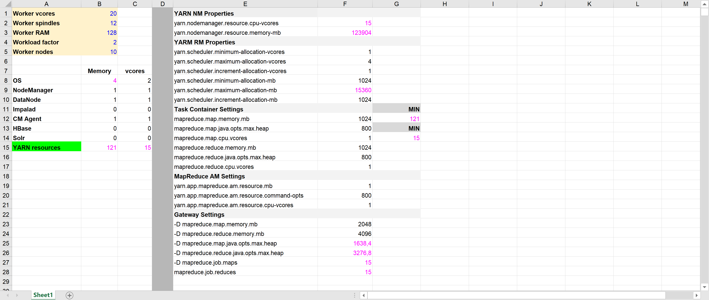

12 GB of ram for the OS seem a high value.  4/6 GB are a better choice, in a standard situation.

In such a way we gain some resources to assign to Yarn jobs.

Workload factor influences the number of map/reduce jobs that can be run concurrently in a VM, but their real limit is the number of vcores of that VM.

A factor of 2 doesn't duplicate the number of possible jobs, but reach the cap of 15 (the installed  vcores): it's the best result that we can obtain. Higher workload factor doesn't give any increment in performance.

