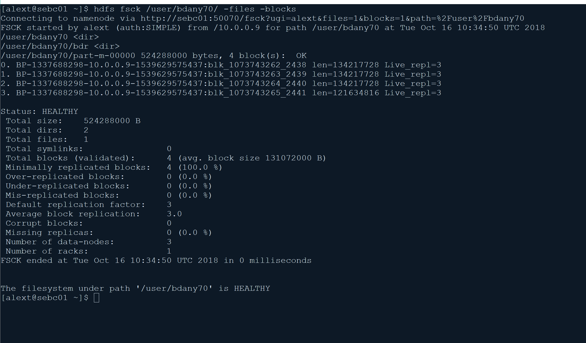

Acquire hdfs user rights:* 

```shell
export HADOOP_USER_NAME=hdfs
```

*Create my target directory :* 

```shell
hadoop fs -mkdir /user/alext64/
```

*Create my partner directory*: 

```shell
hadoop fs -mkdir /user/bdany70/
```

*Create a 500 MB file*: 

```shell
hadoop jar /opt/cloudera/parcels/CDH/jars/hadoop-examples.jar teragen -Dmapred.map.tasks=1 5242880 /user/alext64/unsorted 2>&1 | tee teragen_$(date +'%Y%m%d_%H%M%S')
```

*Take my partner file*:

```shell
 hadoop distcp  hdfs://elephant1.westeurope.cloudapp.azure.com:8020/user/bdany70/unsorted/part-m-00000 hdfs://sebc01:8020/user/bdany70/
```

There is a problem with our network configuration. **Investigating ....**

Other partner:

```shell
hadoop distcp hdfs://gianbo01.northeurope.cloudapp.azure.com/hdfs_lab/gianfolo/unsorted/part-m-00000 hdfs://sebc01:8020/user/bdany70/
```

Opened other ports in Azure firewall

At the end: *added public ip of my partner VMs in my hosts files and set to true dfs.client.use.datanode.hostname* . 

My generated file:


My partner file:


