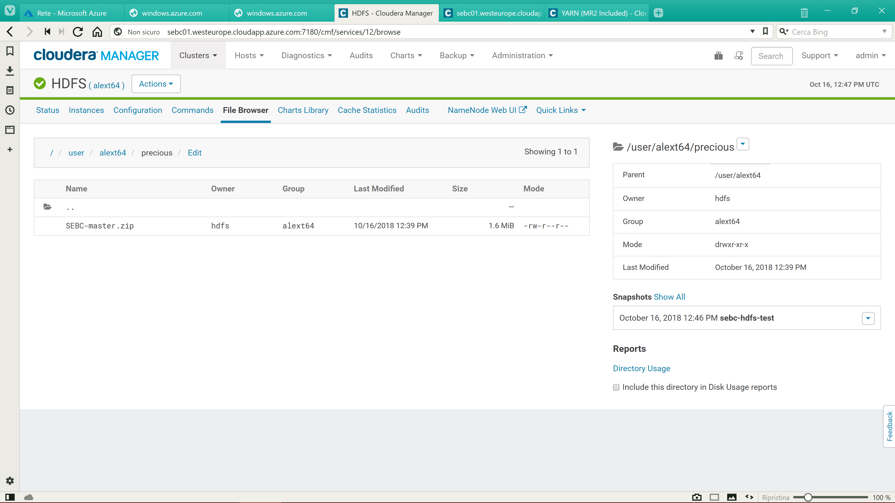
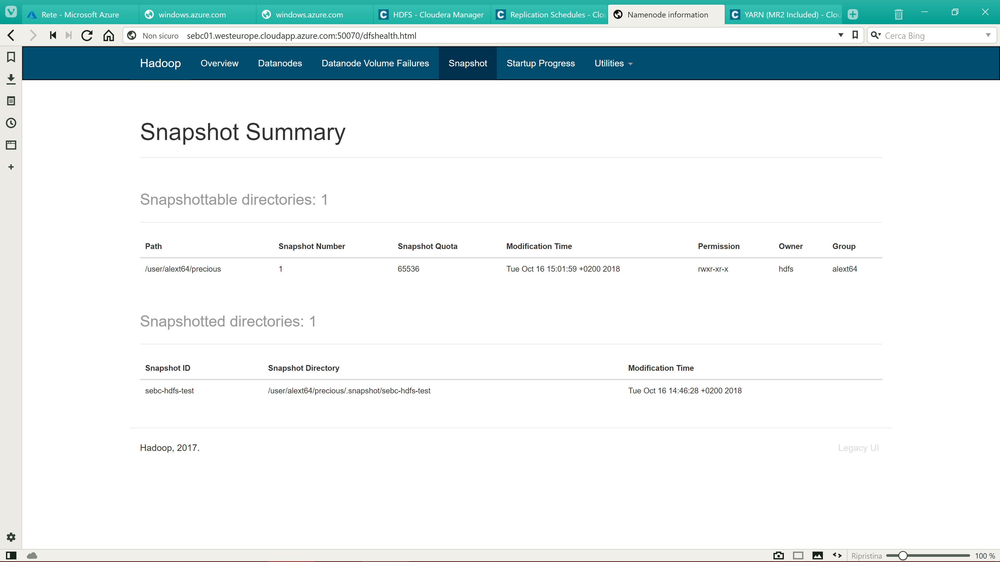

Impesonate hdfs user because sudo .. -c makes troubles:

```shell
export HADOOP_USER_NAME=hdfs
hadoop fs -copyFromLocal /home/alext/SEBC-master.zip /user/alext64/precious/
```

```shell
hadoop fs -ls /user/alext64/precious/*
-rw-r--r--   3 hdfs alext64    1720611 2018-10-16 12:39 /user/alext64/precious/SEBC-master.zip

```

Created snapshot:



Can't remove directory first!

```shell
[alext@sebc01 ~]$ sudo -E su - hdfs -c "hadoop fs -rm  /user/alext64/precious/*.zip"
18/10/16 12:56:01 INFO fs.TrashPolicyDefault: Moved: 'hdfs://sebc01:8020/user/alext64/precious/SEBC-master.zip' to trash at: hdfs://sebc01:8020/user/hdfs/.Trash/Current/user/alext64/precious/SEBC-master.zip

```

Empty trash (forgot -skipTrash!)

```shell
[alext@sebc01 ~]$ sudo -E su - hdfs -c "hadoop dfs -expunge"
DEPRECATED: Use of this script to execute hdfs command is deprecated.
Instead use the hdfs command for it.

18/10/16 13:07:40 INFO fs.TrashPolicyDefault: TrashPolicyDefault#deleteCheckpoint for trashRoot: hdfs://sebc01:8020/user/hdfs/.Trash
18/10/16 13:07:40 INFO fs.TrashPolicyDefault: TrashPolicyDefault#deleteCheckpoint for trashRoot: hdfs://sebc01:8020/user/hdfs/.Trash
18/10/16 13:07:40 INFO fs.TrashPolicyDefault: Deleted trash checkpoint: /user/hdfs/.Trash/181016110000
18/10/16 13:07:40 INFO fs.TrashPolicyDefault: Deleted trash checkpoint: /user/hdfs/.Trash/181016130000
18/10/16 13:07:40 INFO fs.TrashPolicyDefault: TrashPolicyDefault#createCheckpoint for trashRoot: hdfs://sebc01:8020/user/hdfs/.Trash
18/10/16 13:07:40 INFO fs.TrashPolicyDefault: Created trash checkpoint: /user/hdfs/.Trash/181016130740
[alext@sebc01 ~]$
```

But...

```
[alext@sebc01 ~]$ sudo -E su - hdfs -c "hadoop fs -rm -skipTrash -r /user/alext64/precious"
rm: The directory /user/alext64/precious cannot be deleted since /user/alext64/precious is snapshottable and already has snapshots

```

Restored from the snapshot:



